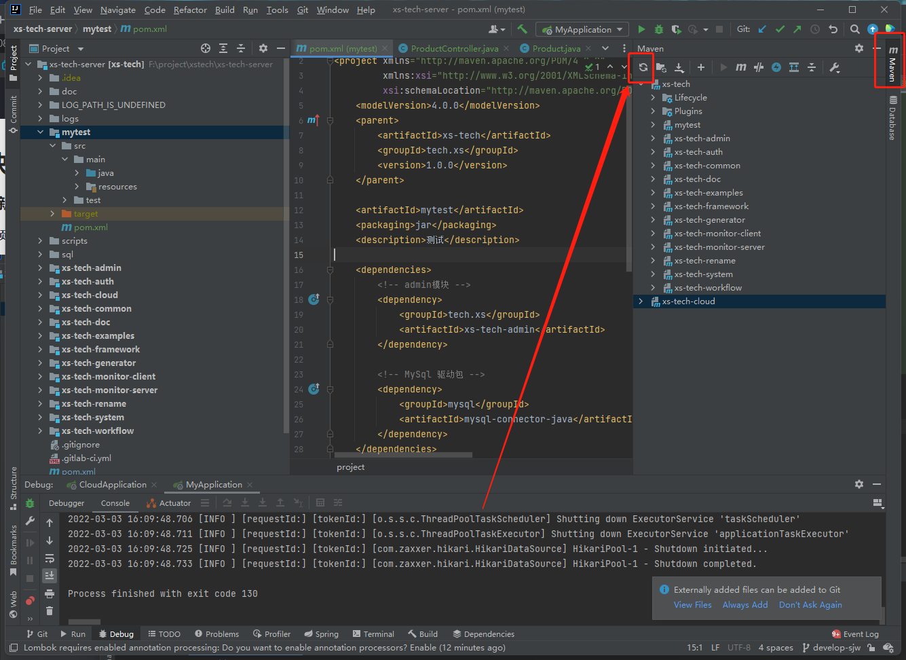

# 快速上手

### 1.新建项目模块

**在项目通添加一个模块**


### 2.修改pom文件


```xml
<?xml version="1.0" encoding="UTF-8"?>
<project xmlns="http://maven.apache.org/POM/4.0.0"
         xmlns:xsi="http://www.w3.org/2001/XMLSchema-instance"
         xsi:schemaLocation="http://maven.apache.org/POM/4.0.0 http://maven.apache.org/xsd/maven-4.0.0.xsd">
    <modelVersion>4.0.0</modelVersion>
    <parent>
        <artifactId>xs-tech</artifactId>
        <groupId>tech.xs</groupId>
        <version>1.0.0</version>
    </parent>

    <artifactId>mytest</artifactId>
    <packaging>jar</packaging>
    <description>测试</description>

    <dependencies>
        <!-- admin模块 -->
        <dependency>
            <groupId>tech.xs</groupId>
            <artifactId>xs-tech-admin</artifactId>
        </dependency>

        <!-- MySql 驱动包 -->
        <dependency>
            <groupId>mysql</groupId>
            <artifactId>mysql-connector-java</artifactId>
        </dependency>
    </dependencies>

    <build>
        <!-- jar包名称-->
        <finalName>mytest</finalName>
        <plugins>
            <plugin>
                <groupId>org.springframework.boot</groupId>
                <artifactId>spring-boot-maven-plugin</artifactId>
                <version>${spring.boot.version}</version>
                <executions>
                    <execution>
                        <goals>
                            <goal>repackage</goal>
                        </goals>
                    </execution>
                </executions>
            </plugin>
        </plugins>
    </build>

</project>
```

### 3.刷新一下maven依赖



### 4.添加yml配置

**需要添加[application.yml,application-dev-local.yml]两个文件**\
**[application.yml]是通用配置,所有项目通用的配置放到这里面**\
**[application-dev-local.yml]是本地开发环境的配置文件,这个文件已经添加到git忽略文件中了**


**application.yml文件内容**

```yaml
server:
  port: 7788
spring:
  profiles:
    active: dev-local
  jackson:
    date-format: yyyy-MM-dd HH:mm:ss
    time-zone: GMT+8
    default-property-inclusion: non_null
  datasource:
    hikari:
      schema: classpath*:sql/mysql/ddl.sql

auth:
  password:
    salt: "5fa8b8c0f703704d46d03edac07c9c34"

mybatis-plus:
  mapper-locations: classpath*:mybatis/**/*.xml
  configuration:
    map-underscore-to-camel-case: true
    use-actual-param-name: true
  type-enums-package: tech.xs.*;com.my.*;

logging:
  config: classpath:log-config/logback.xml

```


**application-dev-local.yml文件内容**

```yaml
spring:
  datasource:
    driver-class-name: com.mysql.cj.jdbc.Driver
    url: jdbc:mysql://127.0.0.1:3306/xs_tech?useUnicode=true&autoReconnect=true&characterEncoding=utf-8&serverTimezone=GMT%2B8&nullCatalogMeansCurrent=true&useSSL=false
    username: root
    password: "xxx"

  redis:
    host: 127.0.0.1
    port: 6379
    database: 1
#    password: xxxx

```

### 5.添加启动类


```java
package com.my;

import org.mybatis.spring.annotation.MapperScan;
import org.springframework.boot.SpringApplication;
import org.springframework.boot.autoconfigure.SpringBootApplication;
import tech.xs.framework.constant.ConfigConstant;

/**
 * 应用程序启动类
 *
 * @author imsjw
 * Create Time: 2020/10/15
 */
@SpringBootApplication(scanBasePackages = {ConfigConstant.ROOT_PACKAGE, "com.my"}, proxyBeanMethods = false)
@MapperScan({ConfigConstant.MYBATIS_SCAN_DAO, "com.my.**.dao"})
public class MyApplication {

    public static void main(String[] args) {
        SpringApplication.run(MyApplication.class, args);
    }

}
```

### 6.创建你自定义的数据库表

```sql
use xs_tech;

CREATE TABLE IF NOT EXISTS my_product
(
    name	VARCHAR(32) COMMENT '用户名',
	code    VARCHAR(32) COMMENT '昵称'
) charset utf8mb4
COLLATE utf8mb4_unicode_ci
ENGINE = INNODB COMMENT '产品';
```

### 7.创建实体类,dao,service,controller


**实体类文件[Product.java]**

```java
package com.my.domain.entity;

import com.baomidou.mybatisplus.annotation.TableField;
import com.baomidou.mybatisplus.annotation.TableName;
import lombok.Getter;
import lombok.Setter;
import lombok.ToString;


@Getter
@Setter
@ToString
@TableName("my_product")
public class Product {

    @TableField("name")
    private String name;

    @TableField("code")
    private String code;

}
```

**Dao文件[ProductDao.java]**

```java
package com.my.dao;

import com.baomidou.mybatisplus.core.mapper.BaseMapper;
import com.my.domain.entity.Product;

public interface ProductDao extends BaseMapper<Product> {

}
```

**Controller文件[ProductController.java]**

```java
package com.my.controller;

import com.baomidou.mybatisplus.core.toolkit.Wrappers;
import com.my.dao.ProductDao;
import com.my.domain.entity.Product;
import org.springframework.web.bind.annotation.GetMapping;
import org.springframework.web.bind.annotation.RequestMapping;
import org.springframework.web.bind.annotation.RestController;

import javax.annotation.Resource;
import java.util.List;

@RestController
@RequestMapping("/product")
public class ProductController {

    @Resource
    private ProductDao productDao;

    @GetMapping("/list")
    public List<Product> list() {
        return productDao.selectList(Wrappers.lambdaQuery());
    }

}

```

### 8.将接口增加到白名单中使其可以访问

**新增auth.json授权文件**


```json
{
  "whiteList": [
    {
      "uri": "/product/list",
      "method": "GET"
    }
  ]
}
```

### 9.启动项目

