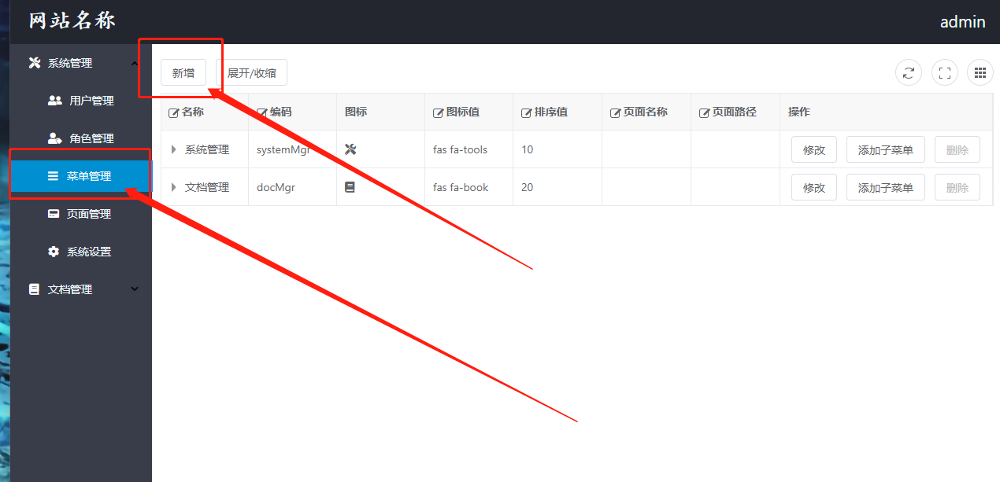

# 快速上手

### 1.新建页面

在自己的模块下添加一个vue文件

**操作流程**


**vue文件内容**

```javascript
<template>
    空页面
</template>

<script>
    export default {
    name: "Blank"
}
</script>

<style scoped>

</style>
```

### 2.添加路由

**找到对应的路由配置文件**


**添加路由**


**路由节点代码**

```javascript
{
    path: '/example/blank',
        component
:
    () => import('@/views/example/Blank')
}
```

**测试路由配置是否成功**

根据路由模式在浏览器栏输入测试地址\
路由模式为 history

```
http://localhost:8080/example/blank
```

路由模式为 hash

```
http://localhost:8080/#/example/blank
```

### 3.添加后台页面数据

**登陆后台->进入页面管理->点击[新增]按钮->添加页面**

添加页面中的[URI]参数需要与路由中的[path]一致


### 4.添加后台菜单

**进入菜单管理页面->点击[新增]按钮->添加菜单**

1. 菜单名称即左侧菜单显示的名称
2. 菜单编码是这个菜单的唯一标识符
3. 图标使用的是fontawesome,可以在[fontawesome](https://fontawesome.com/v5/search?m=free)网站周搜索,需要注意对应的版本,可以参考下方图片
4. 排序值越大,菜单越往下排
5. 页面要选择菜单需要跳转的页面




### 5.查看页面

**刷新页面,查看菜单是否显示出来**\
**如果菜单未显示请给当前登陆用户分配菜单权限,或者使用具有[超级管理员]角色的用户登陆查看**

### 6.打包发布

**执行打包命令***

**打包完成的静态资源文件在当前项目的根目录下的dist文件夹中**

```
yarn run build
```


